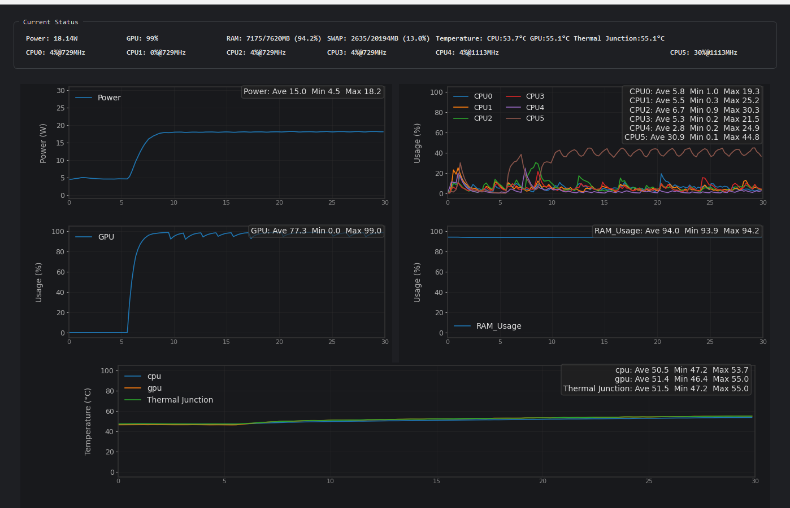

# Jetson Usage Monitor

A real-time monitoring tool for NVIDIA Jetson devices with a PyQt5 GUI interface. Monitor CPU, GPU, memory, temperature, and power consumption remotely via SSH.


## Features

- **Real-time Monitoring**: Live display of Jetson system statistics
- **Multi-core CPU Tracking**: Individual monitoring of all 6 CPU cores
- **GPU Usage**: Real-time GPU utilization tracking
- **Memory Monitoring**: RAM usage with visual indicators
- **Temperature Sensors**: Thermal Junction, CPU, and GPU temperatures
- **Power Consumption**: Real-time power usage monitoring
- **Interactive Graphs**: Tabbed interface with matplotlib-based graphs
- **SSH Connection**: Secure remote monitoring over SSH
- **Connection Testing**: Built-in SSH connection validation
- **Clean Interface**: Two-stage UI design (connection → monitoring)

## Screenshots

### Connection Dialog
The application starts with a connection setup dialog where you enter your Jetson device credentials.

### Monitoring Interface
- **Current Values**: Real-time display of key metrics
- **Power Graph**: Power consumption over time
- **CPU Graph**: Individual core usage tracking
- **GPU Graph**: GPU utilization monitoring
- **RAM Graph**: Memory usage visualization
- **Temperature Graph**: Thermal Junction, CPU, and GPU temperatures

#### Example Screenshot


## Requirements

- Python 3.7+
- NVIDIA Jetson device with SSH access
- Network connectivity to Jetson device

## Installation

1. Clone the repository:
```bash
git clone https://github.com/RyogaYuzawa/jetson-usage-monitor.git
cd jetson-usage-monitor
```

2. Install dependencies:
```bash
pip install -r requirements.txt
```

## Usage

1. Run the GUI application:
```bash
python jetson_tegrastats_gui.py
```

2. Enter your Jetson device connection details:
   - **Host**: IP address of your Jetson device
   - **Port**: SSH port (default: 22)
   - **Username**: SSH username
   - **Password**: SSH password

3. Click "Test Connection" to verify connectivity

4. Click "Connect" to start monitoring

## Configuration

### SSH Connection
- Ensure SSH is enabled on your Jetson device
- Default SSH port is 22 (modify if different)
- The application uses paramiko for secure SSH connections

### Jetson Setup
The tool uses the built-in `tegrastats` command available on all Jetson devices. No additional setup required on the Jetson side.

## Troubleshooting

### Connection Issues
1. **SSH Connection Failed**: 
   - Verify Jetson IP address and network connectivity
   - Check SSH service is running: `sudo systemctl status ssh`
   - Ensure correct username/password

2. **Permission Denied**:
   - Verify SSH credentials
   - Check if user account is not locked

3. **Network Timeouts**:
   - Check firewall settings
   - Verify network connectivity with `ping <jetson_ip>`

### Windows-Specific Issues
- If you encounter socket errors, the application includes Windows-specific SSH optimizations
- Ensure Windows Defender or antivirus is not blocking the application

## Technical Details

### Monitored Metrics
- **CPU**: Per-core usage percentage (6 cores)
- **GPU**: GPU utilization percentage
- **Memory**: RAM usage (used/total)
- **Temperature**: 
  - Thermal Junction (critical internal temperature)
  - CPU temperature
  - GPU temperature
- **Power**: System power consumption in watts

### Data Collection
- Uses NVIDIA's `tegrastats` utility for accurate system metrics
- Real-time SSH streaming for continuous monitoring
- Configurable update intervals

## Project Files

- `jetson_tegrastats_gui.py`: Main GUI application
- `requirements.txt`: Python dependencies
- `README.md`: This documentation

## Dependencies

- **PyQt5**: GUI framework
- **matplotlib**: Graph plotting
- **numpy**: Data processing
- **paramiko**: SSH client
- **Additional libraries**: See `requirements.txt`

## Contributing

1. Fork the repository
2. Create a feature branch: `git checkout -b feature-name`
3. Commit your changes: `git commit -am 'Add some feature'`
4. Push to the branch: `git push origin feature-name`
5. Submit a pull request

## License

This project is open source. Feel free to use, modify, and distribute according to your needs.

## Support

If you encounter any issues or have suggestions for improvements, please open an issue on the GitHub repository.
